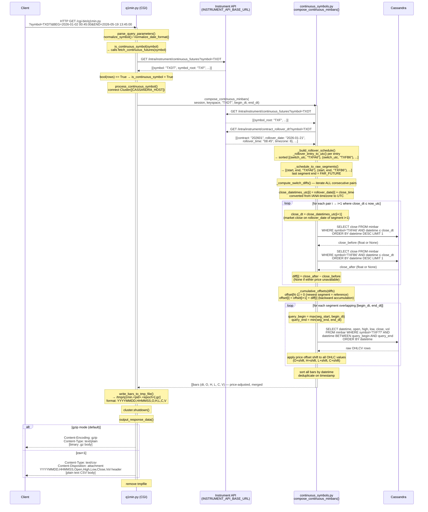

# Continuous Symbol Request Lifecycle

Detailed walkthrough of the `q1min.py` code path when the requested symbol is a
**continuous future** (e.g. `TXDT`, `NQDT`, `ESDT`, `TXON`).

Continuous symbols are synthetic, view-like instruments. No pre-composed data is
stored in Cassandra. Every request triggers on-the-fly composition from the
underlying monthly contract bars with backward close-to-close price adjustment.

---

## Sequence Diagram



---

## Instrument API calls

| Call | Endpoint | Purpose |
|---|---|---|
| `is_continuous_symbol()` check | `GET /intra/instrument/continuous_futures?symbol=<sym>` | Confirm the symbol is registered as a continuous future |
| Resolve `symbol_root` | `GET /intra/instrument/continuous_futures?symbol=<sym>` | Determine base root (e.g. `TXF`, `NQ`) for contract code construction |
| Fetch rollover schedule | `GET /intra/instrument/contract_rollover_dt?symbol=<sym>` | Full ordered list of contract months + rollover datetimes |

The API is called **twice** for `continuous_futures` (once during the guard check in
`q1min.py`, once inside `compose_continuous_minbars`).

---

## Cassandra query pattern

### Price-adjustment lookback (one pair per settled switch point)

```sql
SELECT close FROM {keyspace}.minbar
WHERE symbol = '<contract>' AND datetime <= '<close_dt>'
ORDER BY datetime DESC LIMIT 1
```

`close_dt` = `rollover_date[i+1]` + `close_time` (HHmm from `continuous_futures`) converted
from the symbol's IANA timezone to UTC.  Run for both `before_symbol` and `after_symbol`
only when `now_utc >= close_dt` (market has closed on rollover day).
Results feed `_compute_switch_diffs()` → `_cumulative_offsets()`.

### Bar data fetch (per overlapping segment)

```sql
SELECT datetime, open, high, low, close, vol FROM {keyspace}.minbar
WHERE symbol = '<contract>' AND datetime >= '<query_begin>' AND datetime <= '<query_end>'
ORDER BY datetime
```

Only segments whose `[seg_start, seg_end]` window intersects `[begin_dt, end_dt]`
are queried. Historical segments outside the request window still contribute to the
price-offset computation but are not fetched for bar data.

---

## Price adjustment algorithm

```
offset[N-1] = 0                          # newest settled segment: reference, no shift
offset[i]   = offset[i+1] + diff[i]     # propagate backward
diff[i]     = close(new_contract, close_dt) − close(old_contract, close_dt)
close_dt    = rollover_date[i+1] + close_time  (HHmm, IANA tz → UTC)
```

- All offsets are computed across **all** segments (not just those in the query range),
  so the price level is always anchored to the latest settled front month.
- A diff is only computed when `now_utc >= close_dt` — the market has definitively
  closed on rollover day. Unsettled pairs keep `diff[i] = None` (treated as `0`).
- When either close price is unavailable (no data), `diff[i]` is treated as `0`
  (no adjustment at that switch point).
- `close_time` and its IANA `timezone` come from the `continuous_futures` API row
  (symbol-level fields, same for all contracts of that symbol).

---

## Segment structure example (TXDT, 3 contracts)

```
Index  Contract  seg_start (UTC)      seg_end (UTC)        offset
  0    TXFA6     2025-12-18 00:45     2026-01-21 00:44     +cumulative
  1    TXFB6     2026-01-21 00:45     2026-02-18 00:44     +smaller
  2    TXFC6     2026-02-18 00:45     FAR_FUTURE (9999)    0 (reference)
```

For a request of `BEG=2026-01-15 … END=2026-03-01`:
- Segments 0, 1, and 2 overlap the range → 3 bar-data queries.
- All 3 lookback diffs are computed (switch points 0→1 and 1→2 are in the past).

---

## Environment variables

| Variable | Default | Description |
|---|---|---|
| `INSTRUMENT_API_BASE_URL` | *(required)* | Base URL of the Instrument API |
| `INSTRUMENT_API_TOKEN` | `""` | Bearer token for `Authorization` header |
| `CASSANDRA_HOST` | `cassandra-node` | Cassandra contact point |
| `CASSANDRA_PORT` | `9042` | Cassandra native transport port |
| `CASSANDRA_KEYSPACE` | `tqdb1` | Keyspace containing `minbar` table |
| `CASSANDRA_USER` | `""` | Optional auth username |
| `CASSANDRA_PASSWORD` | `""` | Optional auth password |

---

## Error handling

| Failure point | Behaviour |
|---|---|
| `INSTRUMENT_API_BASE_URL` not set | `RuntimeError` → HTTP 200 with `Content-Type: text/plain` error body |
| Instrument API HTTP error / unreachable | `RuntimeError` propagated → same error response |
| No rows from `continuous_futures` | `compose_continuous_minbars` returns `[]` → empty gzip body |
| No rollover entries | Same as above |
| Cassandra lookback query returns no row | `diff[i] = None` → offset treated as 0, composition continues |
| Cassandra bar query returns no rows for a segment | Segment silently skipped |
| Cassandra connection failure | Exception propagated → error body to client |

---

## Related files

| File | Role |
|---|---|
| [tqdb_cassandra/web/cgi-bin/q1min.py](../tqdb_cassandra/web/cgi-bin/q1min.py) | CGI entry point; dispatches to `process_continuous_symbol()` |
| [tqdb_cassandra/web/cgi-bin/continuous_symbols.py](../tqdb_cassandra/web/cgi-bin/continuous_symbols.py) | All composition logic: API client, segment building, price adjustment, Cassandra queries |
| [tqdb_cassandra/web/CONTINUOUS_SYMBOLS.md](../tqdb_cassandra/web/CONTINUOUS_SYMBOLS.md) | Operational overview (session windows, rollover rules, endpoints) |
| [tqdb_cassandra/CONTINUOUS_FUTURES_REFACTOR.md](../tqdb_cassandra/CONTINUOUS_FUTURES_REFACTOR.md) | Refactor history and design rationale |
| [docs/Q1MIN_REQUEST_LIFECYCLE.md](Q1MIN_REQUEST_LIFECYCLE.md) | High-level lifecycle covering all three symbol paths |
