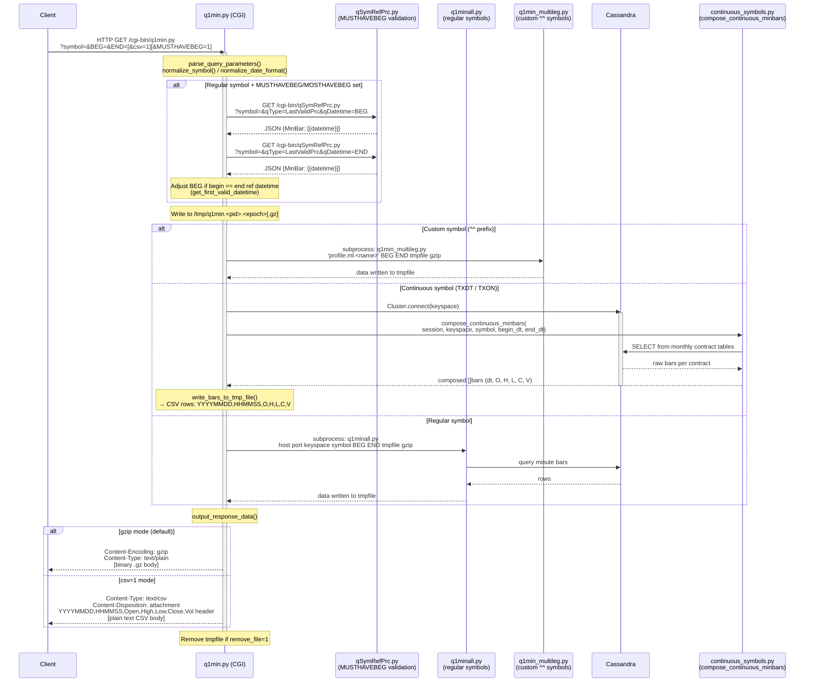

# q1min.py — Request Lifecycle

CGI script located at `tqdb_cassandra/web/cgi-bin/q1min.py`.

Serves minute-level OHLCV bar data for three symbol categories:
- **Regular symbols** — delegated to the legacy `q1minall.py` subprocess
- **Continuous symbols** (`TXDT`, `TXON`) — composed on-demand from underlying Taifex monthly contracts via Cassandra
- **Custom multi-leg symbols** (`^^` prefix) — delegated to `q1min_multileg.py`

---

## Sequence Diagram



---

## Key Decision Points

| Condition | Path |
|---|---|
| `symbol.startswith("^^")` | Custom multi-leg via `q1min_multileg.py` subprocess |
| `is_continuous_symbol(symbol)` | Compose via `continuous_symbols.compose_continuous_minbars()` + Cassandra |
| Neither | Regular path via `q1minall.py` subprocess |
| `MUSTHAVEBEG` or `MOSTHAVEBEG` != `"0"` (regular only) | Pre-validate BEG/END via `qSymRefPrc.py` to find first valid datetime |
| `csv=1` param | Disable gzip, emit CSV with header row |

## Query Parameters

| Parameter | Description |
|---|---|
| `symbol` | Instrument symbol (URL-encoded). Passed through `normalize_symbol()`. |
| `BEG` | Begin datetime, `YYYY-M-D HH:MM:SS`. Zero-padded by `normalize_date_format()`. |
| `END` | End datetime, same format. |
| `csv` | Set to `1` to receive plain-text CSV with header instead of gzip. |
| `MUSTHAVEBEG` / `MOSTHAVEBEG` | Non-`"0"` value triggers first-valid-datetime adjustment (regular symbols only). |

## Output Format

Each bar row (plain or inside gzip):

```
YYYYMMDD,HHMMSS,Open,High,Low,Close,Vol
```

CSV mode prepends a header line:

```
YYYYMMDD,HHMMSS,Open,High,Low,Close,Vol
```
