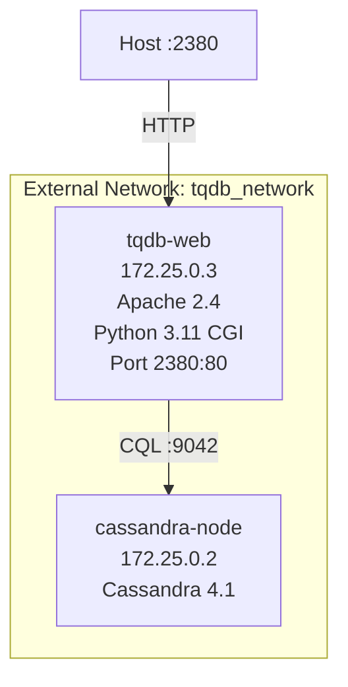

# TQDB Web Container

Containerized web interface for TQDB (Time-series Quote Database) financial data system. Provides HTTP/CGI endpoints for querying tick, second, minute, and daily bar data from Cassandra.

## 🎯 Overview

- **Web Server**: Apache 2.4 with Python 3.11 CGI
- **Database**: Cassandra 4.1+ (external container)
- **Port**: 2380 (mapped to internal 80)
- **Timezone**: UTC
- **Status**: ✅ Production Ready

## 📘 Feature Docs

- `CONTINUOUS_SYMBOLS.md` - TXDT/TXON continuous futures design, API, and operations

## 📁 Directory Structure

```
web-container/
├── Dockerfile                   # Container image definition
├── docker-compose.yml           # Service orchestration
├── cgi-bin/                     # Python CGI scripts (18 endpoints)
│   ├── q1min.py                # Query minute bars
│   ├── q1sec.py                # Query second bars
│   ├── q1day.py                # Query daily bars (aggregated from minutes)
│   ├── qsymbol.py              # List symbols
│   ├── qsyminfo.py             # Symbol metadata
│   ├── eData.py                # Edit/import data
│   ├── eConf.py                # Edit configuration
│   └── ... (11 more scripts)
├── html/                        # Static files (HTML/CSS/JS)
│   ├── index.html              # Main landing page
│   ├── esymbol.html            # Symbol management
│   ├── i1min.html              # Import minute data
│   └── ... (8 more pages)
├── python-binaries/             # Python replacements for legacy C++ binaries
│   ├── qsym.py                 # Query symbols
│   ├── qtick.py                # Query ticks
│   ├── itick.py                # Insert ticks
│   ├── cassandra_query.py      # Common database functions
│   └── ... (2 more binaries)
├── scripts/                     # Data processing scripts
│   ├── q1minall.py             # Query minute bars (Python)
│   ├── q1secall.py             # Query second bars (Python)
│   ├── q1dayall.py             # Aggregate daily bars (Python)
│   ├── Sym2Cass.py             # Import symbols to Cassandra
│   ├── Min2Cass.py             # Import minute bars to Cassandra
│   ├── Sec2Cass.py             # Import second bars to Cassandra
│   └── ... (5 more utilities)
└── config/
    ├── apache.conf             # Apache VirtualHost configuration
    ├── entrypoint.sh           # Startup script with Cassandra health check
    └── init-schema.cql         # Cassandra schema (symbol, tick, secbar, minbar)
```

## 🚀 Quick Start

### Prerequisites

1. **Cassandra must be running** on the external network:
   ```bash
   docker network ls | grep tqdb_network
   ```

2. **Docker & Docker Compose** installed

### Build & Run

```bash
cd tqdb_cassandra/web/

# Build and start
docker compose build
docker compose up -d

# Verify status
docker ps | grep tqdb-web
# Should show: Up X minutes (healthy)

# Check logs
docker compose logs -f
```

### Access

```
Web Interface: http://localhost:2380/
Test Endpoint:  http://localhost:2380/cgi-bin/qsymbol.py
```

### Stop

```bash
docker compose down
```

## 🔧 Configuration

### Environment Variables

Set in `docker-compose.yml`:

| Variable | Default | Description |
|----------|---------|-------------|
| `CASSANDRA_HOST` | `cassandra-node` | Cassandra hostname |
| `CASSANDRA_PORT` | `9042` | Cassandra CQL port |
| `CASSANDRA_KEYSPACE` | `tqdb1` | Database keyspace |
| `TOOLS_DIR` | `/opt/tqdb/tools` | Tools directory path |
| `TZ` | `UTC` | Timezone (UTC+0) |
| `WAIT_FOR_CASSANDRA` | `true` | Wait for Cassandra at startup |

### Network

- **External Network**: `tqdb_network`
- **Container IP**: Dynamically assigned (172.25.0.x)
- **Port Mapping**: `2380:80` (host:container)

## 🏗️ Architecture



## 🔌 API Endpoints

### Symbol Management
- `GET /cgi-bin/qsymbol.py` - List all symbols
- `GET /cgi-bin/qsyminfo.py` - Query symbol metadata
- `POST /cgi-bin/usymbol.py` - Update symbol
- `GET /cgi-bin/qSymRefPrc.py` - Query reference prices
- `GET /cgi-bin/qSymSummery.py` - Symbol summary

### Data Queries
- `GET /cgi-bin/q1min.py` - Query minute bars
- `GET /cgi-bin/q1sec.py` - Query second bars
- `GET /cgi-bin/q1day.py` - Query daily bars (aggregated)
- `GET /cgi-bin/qRange.py` - Query date ranges

### Data Import
- `GET /cgi-bin/i1min_check.py` - Generate import commands
- `POST /cgi-bin/i1min_do.py` - Execute import
- `GET /cgi-bin/i1min_readstatus.py` - Check import status

### Configuration
- `GET /cgi-bin/eConf.py` - Edit configuration
- `POST /cgi-bin/eData.py` - Edit data

### System
- `GET /cgi-bin/qSystemInfo.py` - System information
- `GET /cgi-bin/qSupportTZ.py` - Available timezones (484 zones)

## 🧪 Testing

### Health Check
```bash
# Container status
docker ps | grep tqdb-web

# Health endpoint
curl -f http://localhost:2380/ || echo "FAILED"
```

### Cassandra Connectivity
```bash
# Check from container
docker exec tqdb-web python3 -c "
from cassandra.cluster import Cluster
import os
cluster = Cluster([os.environ['CASSANDRA_HOST']], port=int(os.environ['CASSANDRA_PORT']))
session = cluster.connect(os.environ['CASSANDRA_KEYSPACE'])
print('✓ Connected to Cassandra')
cluster.shutdown()
"
```

### Test Queries
```bash
# List symbols
curl http://localhost:2380/cgi-bin/qsymbol.py

# Query minute bars (if TEST.BTC exists)
curl "http://localhost:2380/cgi-bin/q1min.py?symbol=TEST.BTC&begin_dt=2024-01-01%2000:00:00&end_dt=2024-12-31%2023:59:59"

# Get timezones
curl http://localhost:2380/cgi-bin/qSupportTZ.py
```

### Insert Test Data
```bash
# Use the web interface at http://localhost:2380/esymbol.html
# Or use Python:
docker exec tqdb-web python3 /opt/tqdb/scripts/Sym2Cass.py \
  cassandra-node 9042 tqdb1 TEST.BTC '{"market":"crypto","exchange":"test"}'
```

## 🐛 Debugging

### View Logs
```bash
# Web container logs
docker compose logs -f tqdb-web

# Apache error log
docker exec tqdb-web tail -f /var/log/apache2/error.log

# Apache access log
docker exec tqdb-web tail -f /var/log/apache2/access.log
```

### Interactive Shell
```bash
# Enter container
docker exec -it tqdb-web bash

# Check environment
env | grep CASSANDRA

# Test Python scripts
cd /opt/tqdb/scripts
python3 q1minall.py --help

# Test CGI scripts (as www-data user)
su - www-data -s /bin/bash
cd /var/www/cgi-bin
python3 qsymbol.py
```

### Common Issues

**Issue**: Container fails to start  
**Solution**: Check Cassandra is running and network exists
```bash
docker ps | grep cassandra-node
docker network ls | grep tqdb_network
```

**Issue**: "Connection refused" errors  
**Solution**: Wait for Cassandra to fully start (~30 seconds)
```bash
docker logs tqdb-cassandra-node | grep "Listening for thrift clients"
```

**Issue**: CGI scripts return 500 errors  
**Solution**: Check Apache error log for Python exceptions
```bash
docker exec tqdb-web tail -20 /var/log/apache2/error.log
```

## 📊 Cassandra Schema

Tables in `tqdb1` keyspace:

| Table | Partition Key | Clustering Key | Description |
|-------|---------------|----------------|-------------|
| `symbol` | symbol | - | Symbol metadata (keyval map) |
| `conf` | confkey | - | Configuration key-value pairs |
| `tick` | symbol | datetime (DESC) | Tick-level data |
| `secbar` | symbol | datetime (ASC) | Second bars (OHLCV) |
| `minbar` | symbol | datetime (ASC) | Minute bars (OHLCV) |

**Note**: No `day_bar` table - daily bars are aggregated from `minbar` on-the-fly by `q1dayall.py`

## 🔄 Migration from Legacy

This containerized version replaces the legacy setup with several key changes:

### Architecture Changes
- ✅ **Shell scripts** → Python scripts (q1minall.py, q1secall.py, q1dayall.py)
- ✅ **C++ binaries** → Python binaries (qsym.py, qtick.py, itick.py)
- ✅ **Hardcoded IPs** → Environment variables
- ✅ **profile_tqdb.sh** → Self-contained scripts with explicit variables
- ✅ **timedatectl** → Filesystem-based timezone reading
- ✅ **Symlinks** → Real files (for proper MIME types)

### Compatibility
- All CGI endpoints maintain the same URLs
- All query parameters remain unchanged
- All response formats unchanged (CSV, JSON, text)
- JavaScript frontend unchanged (jQuery, jQuery UI)

### Performance
- Python scripts have similar performance to shell+C++ for most queries
- Cassandra driver provides connection pooling
- Apache worker MPM handles concurrent requests efficiently

## 📋 Maintenance

### Update Container
```bash
# Pull latest code
cd /home/ubuntu/services/tqdb/web-container

# Rebuild
docker compose build --no-cache

# Restart
docker compose down && docker compose up -d
```

### View Resource Usage
```bash
docker stats tqdb-web
```

### Backup Strategy
- **Code**: Version controlled in git (feature-container branch)
- **Data**: Cassandra backups handled separately
- **Config**: Environment variables in docker-compose.yml

### Container Limits
Configured in `docker-compose.yml`:
- **CPU**: 0.5-1.0 cores
- **Memory**: 512MB limit
- **Restart**: unless-stopped

## 📝 Development

### Making Changes

1. **Edit files** in web-container directory
2. **Rebuild**: `docker compose build`
3. **Restart**: `docker compose up -d`
4. **Test**: Check http://localhost:2380
5. **Commit**: Push to git

### Adding New CGI Endpoints

1. Create Python script in `cgi-bin/`
2. Add executable permission in Dockerfile
3. Use environment variables for Cassandra connection:
   ```python
   import os
   from cassandra.cluster import Cluster
   
   cassandra_host = os.environ.get('CASSANDRA_HOST', 'cassandra-node')
   cassandra_port = int(os.environ.get('CASSANDRA_PORT', '9042'))
   cassandra_keyspace = os.environ.get('CASSANDRA_KEYSPACE', 'tqdb1')
   
   cluster = Cluster([cassandra_host], port=cassandra_port)
   session = cluster.connect(cassandra_keyspace)
   ```
4. Rebuild and test

### Adding New HTML Pages

1. Add HTML file to `html/`
2. Reference existing JavaScript libraries (jQuery, jQuery UI)
3. Use existing CSS styling from `style.css`
4. Rebuild container

## 🔒 Security Notes

- Container runs as `www-data` (non-root)
- No external volumes mounted (data isolation)
- Cassandra authentication not enabled (trusted network)
- Apache security headers configured (XSS, clickjacking protection)
- CGI scripts validate input parameters
- File uploads disabled by default

## 📖 Related Documentation

- Parent Project: `/home/ubuntu/services/tqdb/README.md`
- Deployment Guide: `/home/ubuntu/services/tqdb/DEPLOYMENT_GUIDE.md`
- Comprehensive Scan: `/home/ubuntu/services/tqdb/COMPREHENSIVE_SCAN_RESULTS.md`
- Missing Scripts Fix: `/home/ubuntu/services/tqdb/MISSING_SHELL_SCRIPTS_FIX.md`

## ✅ Project Status

**Phase**: Production Ready ✅

| Component | Status | Notes |
|-----------|--------|-------|
| Container Infrastructure | ✅ Complete | Builds in ~3-5 seconds |
| CGI Scripts | ✅ Complete | 18 endpoints refactored |
| Python Binaries | ✅ Complete | 6 binaries replace C++ |
| Static Files | ✅ Complete | 11 HTML/CSS/JS files |
| Data Scripts | ✅ Complete | 7 import/export utilities |
| Query Scripts | ✅ Complete | 3 Python replacements (min/sec/day) |
| Environment Config | ✅ Complete | All use env vars |
| Documentation | ✅ Complete | Comprehensive guides |
| Testing | ✅ Verified | Core functionality working |

**Last Updated**: 2026-02-20  
**Container Version**: 1.0  
**Build Time**: ~3-5 seconds  
**Status**: Healthy and operational on port 2380

---

For issues or questions, check the debugging section above or review logs with `docker compose logs -f tqdb-web`.
